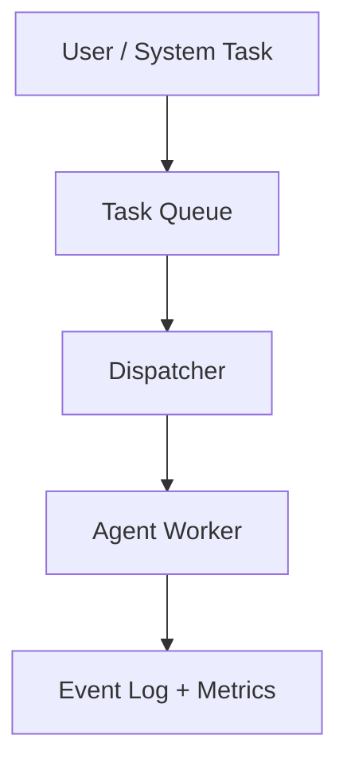

# AIOS Runtime

A lightweight runtime for executing short autonomous AI tasks.

AIOS provides task routing, agent execution, event logging, and runtime telemetry.

⚠️ **AIOS is an experimental personal AI runtime.**

---

## Quick Start

Clone the repo and run the demo runtime:

```bash
git clone https://github.com/YOUR_USERNAME/aios-runtime.git
cd aios-runtime/agent_system
pip install -r requirements.txt
python demo.py
```

---

## Example Run

```
AIOS Demo Runtime
------------------

[TASK] Analyze Python code quality
  Router: coder
  Agent: coder_agent
  Result: Code looks clean. Suggest adding type hints.
  Time: 1.0s

[TASK] Monitor system resources
  Router: monitor
  Agent: monitor_agent
  Result: CPU 12% | RAM 6.1GB/32GB
  Time: 1.0s

[TASK] Analyze error logs
  Router: analyst
  Agent: analyst_agent
  Result: Pattern detected: retry loop in error logs
  Time: 1.0s

Demo completed [OK]
```

---

## Architecture



---

## What AIOS Does

- **Task Routing** - Automatically routes tasks to specialized agents (coder/monitor/analyst)
- **Execution Tracking** - Records every task execution with timestamps and results
- **Self-Improvement** - Learns from failures and adjusts strategies over time
- **Health Monitoring** - Tracks system health and agent performance metrics

---

## Main-Chain Baselines

AIOS treats “a task is done” as an end-to-end, reproducible chain with artifacts and evidence.

### Mouseflow Main Chain (Repeatable Baseline)

```powershell
$env:PYTHONPATH="g:/TaijiOS_Backup"
python g:/TaijiOS_Backup/aios/agent_system/scripts/verify_mouseflow_main_chain_baseline.py --repeat 5
```

Pass criteria:
- `terminal_state=completed`
- `reason_code=ok`
- `blocked_stage=none`
- Evidence exists on disk (analysis_outputs + task_executions + spawn_results)

### Shared External Memory (shared_state.json)

Shared state is a minimal collaboration layer designed for “read-before-work / write-after-work”.

File: `memory/shared_state.json`

Fixed fields:
- `current_goal` (single source of truth)
- `active_task`
- `latest_decision`
- `handoff_notes`
- `last_execution` (terminal_state + summary + evidence)

CLI:

```powershell
$env:PYTHONPATH="g:/TaijiOS_Backup"
python g:/TaijiOS_Backup/aios/agent_system/scripts/shared_state_cli.py --get current_goal
python g:/TaijiOS_Backup/aios/agent_system/scripts/shared_state_cli.py --set active_task --value "..." --writer "xiaojiu" --task-id "task-001"
python g:/TaijiOS_Backup/aios/agent_system/scripts/shared_state_cli.py --set-last-execution --terminal-state completed --reason-code ok --summary "..." --evidence "path-or-url" --writer "xiaojiu" --task-id "task-001"
```

---

## Full Runtime

The demo uses a mock executor for simplicity. The full runtime requires:
- OpenClaw environment for real agent execution
- LanceDB for experience learning
- Telegram integration for notifications

See `agent_system/` for the complete implementation.

---

## License

MIT
